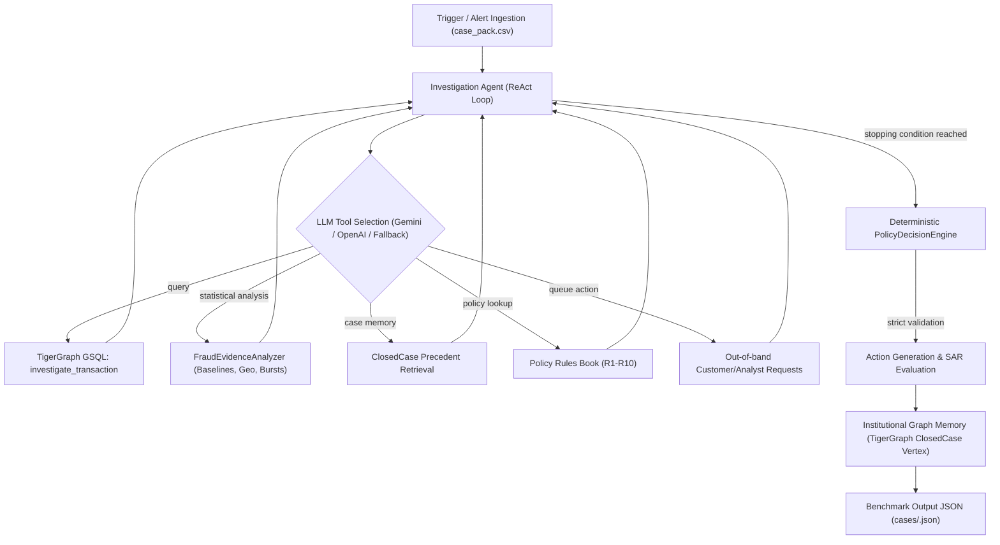

# Agentic Fraud Investigation System Architecture

## 1. Overview & System Mission
The **TigerGraph Autonomous Fraud Investigation Agent** is designed for real-time investigation of credit card fraud alerts in financial institutions. It bridges the gap between fast graph-native multi-hop topology querying in **TigerGraph Savanna Cloud** and **Agentic LLM Multi-step Reasoning**, backed by strict, deterministic regulatory policy enforcement (R1–R10, FinCEN SAR compliance, and 3-tier approval routing).

---

## 2. Core Architectural Components

### A. LLM Provider Layer (`src/agent/llm_provider.py`)
- **`LLMProvider` Abstract Base Class**: Exposes `select_next_action` and `synthesize_investigation`.
- **Implementations**:
  1. `GeminiProvider`: Connects to Google Generative AI (e.g. Gemini 1.5 Pro) with structured JSON schema outputs.
  2. `OpenAIProvider`: Connects to OpenAI (e.g. GPT-4o) using native function calling/structured completions.
  3. `DeterministicFallbackProvider`: Fully offline, deterministic reasoning engine that guides tool progression, rationale generation, and synthesis without requiring external API tokens or network calls.

### B. State Management & Telemetry (`src/agent/agent_state.py`)
- **`InvestigationState`**: Tracks case ID, trigger metadata, raw graph payload, extracted evidence features, historical case precedents, queued external requests, policy determinations, uncertainties, and termination flags.
- **`ToolCallRecord`**: Captures step number, tool name, arguments, execution duration ($s$), human-readable summary, and agent rationale for full auditability.

### C. Investigation Tool Suite (`src/agent/tools.py`)
- **`retrieve_case_trigger`**: Extracts case metadata and flagged transaction ID.
- **`investigate_transaction`**: Invokes TigerGraph GSQL query over Savanna Cloud (`investigate_transaction`) retrieving a 2-hop neighborhood of customer history, cards, devices, and closed cases.
- **`analyze_evidence`**: Computes customer baseline spending, geographic distance, device sharing networks, and temporal transaction burst clustering.
- **`get_similar_closed_cases`**: Retrieves outcomes, narratives, and losses of historical closed cases from institutional graph memory.
- **`get_policy_rule`**: Exposes official rules R1–R10 documentation.
- **`request_customer_validation` / `request_analyst_information`**: Queues structured external validation requests without fabricating synthetic customer responses.
- **`evaluate_policy_decision`**: Dispatches structured evidence to the deterministic policy engine.
- **`write_case_to_graph_memory`**: Inserts resolved investigations back into TigerGraph as `ClosedCase` vertices and incident edges (`involves`, `connected_to`).

### D. Policy Decision Engine Guardrail (`src/policy/decision_engine.py`)
- The LLM **cannot** override policy rules, create arbitrary actions, or alter loss calculations.
- Evaluates 5 fraud patterns: `card_testing`, `card_not_present_fraud`, `card_not_present_new_device`, `out_of_region_use`, and `account_takeover`.
- Enforces strict exposure calculations across multi-transaction episodes (e.g., Product C bursts).
- Computes regulatory SAR triggers: `exposure >= $2000` or syndicate link / rapid multi-txn bursts on compromised cards.
- Enforces 3-tier routing: `auto` ($<\$1,000$), `L1` ($\$1,000 \le \text{exposure} < \$10,000$), and `L2` ($\ge \$10,000$).

---

## 3. Tool Specifications & Schemas

| Tool Name | Parameters | Return Type | Description |
| :--- | :--- | :--- | :--- |
| `retrieve_case_trigger` | `case_id: str` | `Dict[str, Any]` | Reads trigger type, text, flagged transaction, customer, and initial risk score. |
| `investigate_transaction` | `transaction_id: str` | `Dict[str, Any]` | Multi-hop TigerGraph GSQL graph traversal returning customer profile, historical txns, device, and linked cases. |
| `analyze_evidence` | `transaction_id: str` | `Dict[str, Any]` | Statistical baseline, z-scores, geographic anomaly scoring, burst clustering. |
| `get_similar_closed_cases`| `case_ids: List[str]` | `List[Dict[str, Any]]` | Resolution details from closed case repository. |
| `get_policy_rule` | `rule_id: str` | `Dict[str, str]` | Documented logic for R1–R10. |
| `request_customer_validation` | `question: str, channel: str` | `Dict[str, Any]` | Queues non-blocking out-of-band verification. |
| `request_analyst_information` | `question: str` | `Dict[str, Any]` | Queues manual analyst triage. |
| `evaluate_policy_decision` | `case_id: str, trigger_type: str` | `Dict[str, Any]` | Evaluates strict rules R1–R10 and computes final action chain and SAR. |
| `write_case_to_graph_memory` | `case_id: str, case_decision: Dict, case_meta: Dict` | `bool` | Upserts `ClosedCase` vertex and graph edges into TigerGraph Savanna. |

---

## 4. Execution Workflow

1. **Trigger Ingestion**: The agent is triggered with a `case_id` (e.g. `HHG-006`).
2. **ReAct Loop**:
   - The LLM selects `investigate_transaction` to retrieve the transaction subgraph from TigerGraph.
   - The LLM selects `analyze_evidence` to compute customer baseline statistics, geographic travel distance, and identify episode bursts.
   - The LLM inspects connected `ClosedCase` history via `get_similar_closed_cases`.
   - The LLM determines if additional information is required or if stopping criteria are met.
3. **Policy Determination**:
   - `PolicyDecisionEngine` calculates the final verdict, pattern, exposure amount, initial/final next-best actions with approval routes, and FinCEN SAR filing requirements.
4. **Institutional Memory Persistence**:
   - Case details, exposure, outcome, and affected transactions are written into TigerGraph via REST++ upsert.
5. **Synthesis & Benchmark Output**:
   - The LLM synthesizes a concise executive narrative and the agent outputs the benchmark JSON conformant to the hackathon specification.

---

## 5. Verification & Testing

The system is tested using `unittest` covering 10 distinct test specifications:
- `test_01_tool_definitions_and_schema`: Schema completeness.
- `test_02_invalid_case_id_handling`: Robust exception handling.
- `test_03_hhg001_legitimate_flow`: Legitimacy baseline verification.
- `test_04_hhg006_burst_and_exposure`: 4-transaction Product C burst grouping ($1,906.07 exposure).
- `test_05_hhg011_burst_and_exposure`: 10-transaction Product C burst grouping ($470.97 exposure).
- `test_06_hhg017_card_testing_rejection`: Verification that 3 x ~$100 txns reject R5 card testing and resolve legitimately under R1 ($0.00 exposure).
- `test_07_hhg005_device_sharing_legitimate`: Verification that shared iOS device in home region resolves legitimately under R1 ($0.00 exposure).
- `test_08_policy_boundary_immutability`: Guardrail verification preventing unauthorized actions.
- `test_09_evidence_request_queueing`: Verification of non-fabricating out-of-band request queueing.
- `test_10_provider_factory`: Correct factory instantiation.
