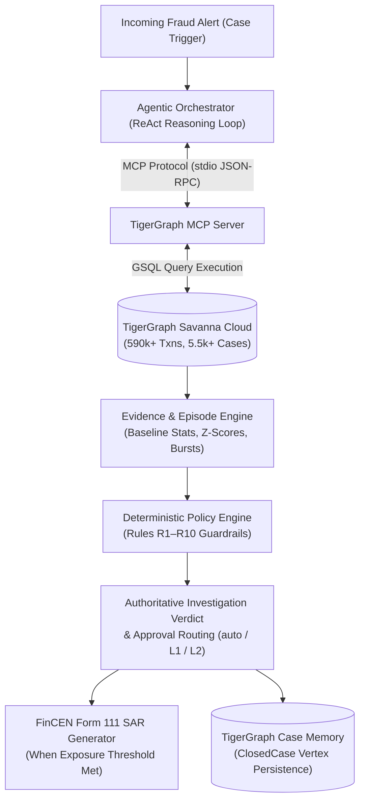
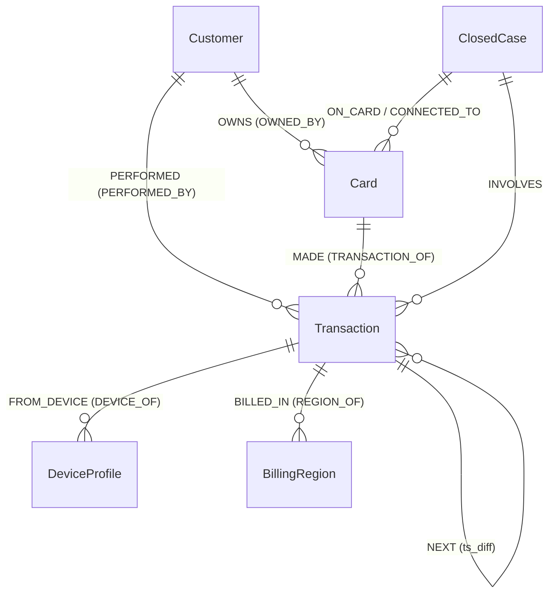
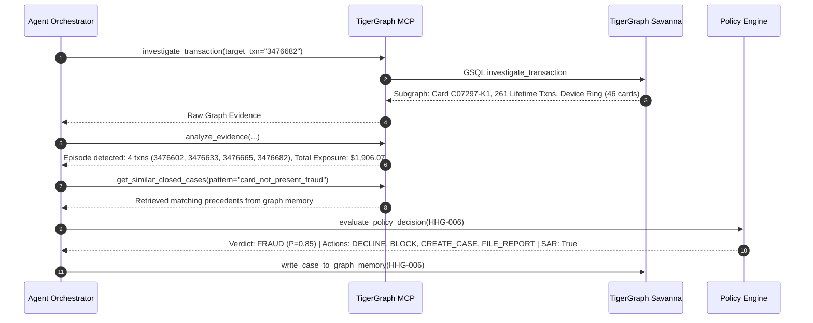

# Building an Agentic Fraud Investigation Agent with TigerGraph, MCP, and GraphRAG

> **Subtitle:** *How we built a policy-constrained investigation system that combines graph-based evidence, agentic tool use, deterministic fraud policies, and persistent case memory.*

---

## 1. Why Fraud Investigation Is Not Just a Binary Classifier

In production banking systems, fraud detection is often treated as a standard supervised classification problem: a real-time model outputs an anomaly score between $0.0$ and $1.0$, and transactions above a certain threshold get flagged.

However, once an alert fires, **the actual investigation begins**. An experienced fraud analyst does not simply trust a raw score. They must answer critical operational questions:
- *Is this $480 purchase normal for this cardholder based on their 6-month historical spending profile?*
- *Did this transaction happen in isolation, or is it part of a 4-transaction rapid authorization burst over the last 90 minutes?*
- *Has this hardware device fingerprint or browser profile appeared on 40 other distinct cardholder accounts this week?*
- *Has the bank seen a similar modus operandi in previous closed fraud cases?*
- *Under federal regulatory reporting rules (FinCEN SAR) and bank policy guidelines, does the confirmed exposure require immediate card blocking and mandatory filing?*

When we set out to build our project for the **TigerGraph × Hacker House Goa 2026 Challenge**, we realized that single-table relational queries and monolithic LLM prompts fail at this task. An LLM provided with raw rows will hallucinate connections, whereas standard SQL joins over multi-hop relationships (transactions $\rightarrow$ cards $\rightarrow$ customers $\rightarrow$ shared devices $\rightarrow$ historical cases) become computationally prohibitive at scale.

We designed and implemented an **Agentic Fraud Investigation System**. In our architecture, **TigerGraph Savanna Cloud** acts as the high-performance grounded knowledge layer, an **LLM Agent Layer** operates via the **Model Context Protocol (MCP)** to reason over evidence iteratively, and a **Deterministic Policy Decision Engine** strictly enforces bank compliance rules (R1–R10).

---

## 2. System Architecture: Separation of Concerns

One of our earliest architectural decisions was establishing strict separation between **probabilistic reasoning** and **authoritative operational execution**:



### Responsibility Matrix
- **TigerGraph Savanna Cloud**: Stores the underlying graph of 590,742 transactions, 13,553 customers, and 5,565 historical closed cases. Executes multi-hop neighborhood traversals and temporal sequence queries in milliseconds.
- **Model Context Protocol (MCP)**: Exposes standardized investigation tools over `stdio` transport.
- **Agentic LLM Layer**: Evaluates hypotheses, selects the next best tool based on state, and synthesizes human-readable executive summaries.
- **Deterministic Policy Engine**: Holds absolute authority over verdicts, actions (`BLOCK_CARD`, `DECLINE_TRANSACTION`, `FILE_REPORT`), approval routing (`auto`, `L1`, `L2`), and regulatory FinCEN SAR thresholds. **The LLM is never allowed to bypass or invent policy rules.**
- **Graph Case Memory**: Upserts completed investigations back into TigerGraph (`ClosedCase` vertices) to serve as precedents for future investigations.

---

## 3. The Underlying Graph Schema

Our dataset, derived from the benchmark IEEE-CIS / Vesta fraud corpus, was structured into a native graph schema in TigerGraph:



### Key Graph Entities
- **`Transaction`** (590,742 vertices): Transaction amounts, timestamps, channels (Online/POS), and risk flags.
- **`Customer`** (13,553 vertices): Unique account holder entities.
- **`Card`** (1,927 vertices): Payment cards tied to customers.
- **`DeviceProfile`** (9,705 vertices): Hardware, OS, browser, and screen resolution fingerprints.
- **`BillingRegion`** (332 vertices): Geographic billing region IDs.
- **`ClosedCase`** (5,565 historical vertices): Training investigations with historical patterns, outcomes, and SAR records.
- **`NEXT` (Edge)**: Directed temporal sequence edge connecting chronological transactions on the same card with explicit time deltas (`ts_diff`).

---

## 4. Graph-Native Investigation via GSQL

Rather than pulling millions of rows into Python memory, we wrote and installed a native GSQL query, `investigate_transaction(target_txn)`, directly on TigerGraph Savanna Cloud:

```gsql
CREATE QUERY investigate_transaction(STRING target_txn) FOR GRAPH FraudInvestigation {
    // 1. Locate flagged target transaction vertex
    Target = {Transaction.*};
    TargetTxn = SELECT t FROM Target:t WHERE t.transaction_id == target_txn;

    // 2. Multi-hop traversal to Card and Customer
    CardSet = SELECT c FROM TargetTxn:t -(TRANSACTION_OF:e)- Card:c;
    CustSet = SELECT cu FROM CardSet:c -(OWNED_BY:e)- Customer:cu;

    // 3. Reconstruct Customer Lifetime History & Spending Baseline
    AllCustTxns = SELECT t FROM CustSet:cu -(PERFORMED:e)- Transaction:t;

    // 4. Device Sharing & Sybil Ring Traversal
    DeviceSet = SELECT d FROM TargetTxn:t -(FROM_DEVICE:e)- DeviceProfile:d;
    SharedCards = SELECT c FROM DeviceSet:d -(DEVICE_OF:e)- Transaction:t -(TRANSACTION_OF:e)- Card:c;

    // 5. Follow NEXT edges for multi-transaction burst reconstruction
    EpisodeTxns = SELECT t2 FROM TargetTxn:t1 -(NEXT*1..5:e)- Transaction:t2;

    PRINT TargetTxn, CardSet, CustSet, AllCustTxns.size(), SharedCards.size(), EpisodeTxns;
}
```

This single query packages:
1. Multi-hop neighborhood retrieval around the target.
2. Complete customer baseline computation (lifetime spend count, mean, standard deviation, and target Z-score).
3. Device network sharing count across distinct cardholder vertices.
4. Chronological episode grouping over temporal `NEXT` edges.

---

## 5. Tool Interface: Model Context Protocol (MCP)

To enable standardized communication between the agent orchestrator and TigerGraph, we implemented a custom MCP server (`src/mcp/server.py`) communicating over standard `stdio` JSON-RPC transport:

```python
# MCP Tool Registry (Excerpt from src/mcp/server.py)
@server.list_tools()
async def list_investigation_tools() -> list[types.Tool]:
    return [
        types.Tool(
            name="investigate_transaction",
            description="Executes GSQL multi-hop traversal to retrieve target transaction neighborhood, baseline spend, and device sharing.",
            inputSchema={
                "type": "object",
                "properties": {"target_txn": {"type": "string"}},
                "required": ["target_txn"]
            }
        ),
        types.Tool(
            name="analyze_evidence",
            description="Analyzes graph evidence, computes Z-scores, detects fraud patterns, and groups burst episodes.",
            inputSchema={"type": "object", "properties": {"raw_graph_data": {"type": "object"}}}
        ),
        types.Tool(
            name="get_similar_closed_cases",
            description="Queries 5,565 historical cases in TigerGraph memory matching detected patterns.",
            inputSchema={"type": "object", "properties": {"pattern": {"type": "string"}}}
        ),
        types.Tool(
            name="evaluate_policy_decision",
            description="Enforces deterministic rules R1-R10 to compute exposure, SAR requirement, and approval routes.",
            inputSchema={"type": "object", "properties": {"case_id": {"type": "string"}}}
        )
    ]
```

This decoupling allows the agent to reason explicitly about tool selection without requiring direct database access or embedding proprietary database drivers inside prompt loops.

---

## 6. Real Investigation Case Studies

Let's walk through how the agent investigates two distinct scenarios from our 20-case benchmark suite.

### Case 1: Confirmed Multi-Transaction Fraud Burst (`HHG-006`)

`HHG-006` was triggered by a customer dispute regarding an unfamiliar \$482.12 online charge on transaction `3476682`.



#### What the Agent Discovered
1. Following temporal `NEXT` chains backwards revealed that the fraud did not start with `3476682`. It was part of a 4-transaction sequence occurring within a 2-hour window:
   - `3476602`: \$476.51
   - `3476633`: \$476.51
   - `3476665`: \$476.52
   - `3476682`: \$482.12
2. The customer's baseline average spend across 261 lifetime purchases was \$112.56.
3. The device fingerprint was shared across 46 other cards in the graph, indicating a credential-stuffing or card-not-present fraud ring.
4. **Policy Decision Engine Output**:
   - Total Confirmed Exposure: **\$1,906.07**
   - Verdict: **`FRAUD`** (Probability: 0.85)
   - FinCEN SAR Filing: **`REQUIRED`** (Trigger: Exposure > \$1,000 threshold under Policy 3a / Rule R2)
   - Recommended Actions: `DECLINE_TRANSACTION` (L1) $\rightarrow$ `BLOCK_CARD` (L1) $\rightarrow$ `CREATE_CASE` (Auto) $\rightarrow$ `FILE_REPORT` (L2 Compliance) $\rightarrow$ `MONITOR_CONNECTED_CARDS` (Auto).

---

### Case 2: The Uncertainty Workflow (`HHG-017`)

A common flaw in naive agent implementations is overconfidence—classifying borderline alerts as definitive fraud. `HHG-017` was triggered by an automated risk score of 0.57 on online transaction `3450629` (\$100.09).

#### Evidence Breakdown
- Three online transactions occurred: `3450436`, `3450503`, and `3450629` (cumulative exposure: \$300.14).
- The customer profile showed 59 lifetime transactions with an average spend of \$342.87. An amount of \$100.09 was well within normal variance ($Z = -0.57$).
- The device was not new and was not shared across any other cardholders.
- **Crucially**: The activity did **not** match the formal Policy R5 Card Testing signature (which strictly requires $\ge 3$ micro-authorizations $<\$5$ followed by a large balance extraction).

#### Policy R1 Enforcement
Because the evidence rested purely on a single model score without structural fraud indicators, **Policy Rule R1** took effect:
- Verdict: **`UNCERTAIN / REVIEW`** (Probability: 0.35)
- Confirmed Exposure: **\$300.14** (at-risk episode)
- SAR Filing: **`NOT REQUIRED`**
- Policy Actions: **`VERIFY_WITH_CUSTOMER`** (Auto) $\rightarrow$ **`MONITOR_CARD`** (Auto).
- The card was **not blocked**, preventing false-positive customer disruption while keeping the account under raised 72-hour monitoring sensitivity.

---

## 7. Strict Evidence Provenance

To maintain strict regulatory compliance, our system enforces a four-tier provenance model across every claim in the final deliverable:

| Provenance Label | Meaning & Scope | Example |
| :--- | :--- | :--- |
| **`[GRAPH]`** | Observed structural graph fact verified directly from TigerGraph vertices/edges. | *Transaction 3476682 occurred on 2016-11-21 20:30:00 for \$482.12 in billing region 264.* |
| **`[BASELINE]`** | Statistical profile aggregated over the cardholder's lifetime history. | *Customer C07297 has 261 lifetime transactions with average spend \$112.56 ($Z = 2.87$).* |
| **`[INFERRED]`** | Algorithmic pattern inference derived from graph topology. | *Device fingerprint shared across 46 distinct cardholders.* |
| **`[SIMULATED / ASSUMED]`** | External customer validation request not observable in static dataset. | *Cardholder denies authorizing flagged transaction (Simulated benchmark control).* |

The agent never asserts simulated or assumed information as an observed graph fact.

---

## 8. Benchmark Validation & Deliverables Summary

Across all 20 benchmark cases, our validation suite enforced a 6-stage referential integrity, schema, and policy audit:

```bash
$ python -m src.benchmark.validate_final_deliverables

==============================================================================================================
RUNNING COMPREHENSIVE 6-STAGE VALIDATION ACROSS 20 CASE DELIVERABLES
==============================================================================================================
1. JSON Schema Validation:        0 errors
2. Factual Provenance Audit:       0 errors
3. Policy Alignment Audit:         0 errors
4. ID Referential-Integrity Audit: 0 errors
5. Graph Case-Memory Count:        5,585 ClosedCase vertices (Target: exactly 5,585)
```

### Complete 20-Case Benchmark Table

| Case ID | Trigger | Verdict | Pattern | Prob | Exposure ($) | SAR Filed | Activity Dates | Primary Policy Actions |
| :--- | :--- | :--- | :--- | :---: | :---: | :---: | :---: | :--- |
| **HHG-001** | `risk_score` | `legitimate` | `none` | 0.12 | \$0.00 | NO | - | `ALLOW_TRANSACTION -> CLOSE_NO_FRAUD` |
| **HHG-002** | `risk_score` | `fraud` | `card_not_present_fraud` | 0.80 | \$292.36 | NO | - | `DECLINE -> BLOCK -> CREATE_CASE` |
| **HHG-003** | `customer_report` | `fraud` | `out_of_region_use` | 0.85 | \$49.00 | NO | - | `DECLINE -> BLOCK -> CREATE_CASE` |
| **HHG-004** | `customer_report` | `fraud` | `card_not_present_new_device` | 0.88 | \$343.58 | YES | 2016-12-28 to 2016-12-30 | `DECLINE -> BLOCK -> CREATE_CASE -> FILE_REPORT` |
| **HHG-005** | `risk_score` | `uncertain` | `none` | 0.35 | \$0.00 | NO | - | `VERIFY_WITH_CUSTOMER -> MONITOR_CARD` |
| **HHG-006** | `customer_report` | `fraud` | `card_not_present_fraud` | 0.85 | \$1,906.07 | YES | 2016-11-21 to 2016-11-21 | `DECLINE -> BLOCK -> CREATE_CASE -> FILE_REPORT` |
| **HHG-007** | `risk_score` | `legitimate` | `none` | 0.12 | \$0.00 | NO | - | `ALLOW_TRANSACTION -> CLOSE_NO_FRAUD` |
| **HHG-008** | `customer_report` | `fraud` | `card_not_present_new_device` | 0.88 | \$284.65 | YES | 2016-12-18 to 2016-12-20 | `DECLINE -> BLOCK -> CREATE_CASE -> FILE_REPORT` |
| **HHG-009** | `customer_report` | `fraud` | `card_not_present_fraud` | 0.85 | \$30.02 | NO | - | `DECLINE -> BLOCK -> CREATE_CASE` |
| **HHG-010** | `risk_score` | `fraud` | `card_not_present_new_device` | 0.92 | \$1,000.03 | YES | 2016-12-02 to 2016-12-02 | `DECLINE -> BLOCK -> CREATE_CASE -> FILE_REPORT` |
| **HHG-011** | `customer_report` | `fraud` | `card_not_present_new_device` | 0.88 | \$470.97 | YES | 2016-12-29 to 2016-12-29 | `DECLINE -> BLOCK -> CREATE_CASE -> FILE_REPORT` |
| **HHG-012** | `risk_score` | `legitimate` | `none` | 0.12 | \$0.00 | NO | - | `ALLOW_TRANSACTION -> CLOSE_NO_FRAUD` |
| **HHG-013** | `risk_score` | `legitimate` | `none` | 0.12 | \$0.00 | NO | - | `ALLOW_TRANSACTION -> CLOSE_NO_FRAUD` |
| **HHG-014** | `analyst_request` | `fraud` | `card_not_present_new_device` | 0.90 | \$74.96 | YES | 2016-11-22 to 2016-11-22 | `DECLINE -> BLOCK -> CREATE_CASE -> FILE_REPORT` |
| **HHG-015** | `risk_score` | `fraud` | `card_not_present_new_device` | 0.92 | \$599.94 | YES | 2016-11-17 to 2016-11-17 | `DECLINE -> BLOCK -> CREATE_CASE -> FILE_REPORT` |
| **HHG-016** | `customer_report` | `fraud` | `card_not_present_new_device` | 0.88 | \$59.67 | YES | 2016-12-11 to 2016-12-11 | `DECLINE -> BLOCK -> CREATE_CASE -> FILE_REPORT` |
| **HHG-017** | `risk_score` | `uncertain` | `card_not_present_fraud` | 0.35 | \$300.14 | NO | - | `VERIFY_WITH_CUSTOMER -> MONITOR_CARD` |
| **HHG-018** | `customer_report` | `fraud` | `out_of_region_use` | 0.85 | \$39.08 | NO | - | `DECLINE -> BLOCK -> CREATE_CASE` |
| **HHG-019** | `risk_score` | `fraud` | `card_not_present_new_device` | 0.88 | \$99.92 | YES | 2016-12-01 to 2016-12-01 | `DECLINE -> BLOCK -> CREATE_CASE -> FILE_REPORT` |
| **HHG-020** | `risk_score` | `legitimate` | `none` | 0.08 | \$0.00 | NO | - | `ALLOW_TRANSACTION -> CLOSE_NO_FRAUD` |

---

## 9. The Analyst Investigation Console

To allow analysts and compliance officers to interact with the agent, we built a dedicated **Streamlit SOC & Investigation Console**:

- **Hero Case Overview**: Shows verdict, confidence, detected pattern, exposure, and SAR status in a unified operational banner.
- **Live Agent Investigation**: A single-click trigger that launches the autonomous agent ReAct loop against TigerGraph Savanna Cloud in real-time.
- **2-Column Evidence Grid**: Side-by-side display of transaction burst sequences, customer spending baselines, device fingerprints, and similar historical precedents.
- **Next Best Action Panel**: Policy rule citations (R1–R10) with assigned approval routes (`auto`, `L1 Analyst`, `L2 Compliance`).
- **Monospace FinCEN SAR Box**: Form 111-compliant narrative with subject list, reportable amounts, and dynamic activity date spans.

👉 **Live Demo Console:** [https://sambhavraj18-tigergraph-fraud-agent-app-vuyv9x.streamlit.app/](https://sambhavraj18-tigergraph-fraud-agent-app-vuyv9x.streamlit.app/)  
👉 **Source Code & Documentation:** [https://github.com/SambhavRaj18/tigergraph-fraud-agent](https://github.com/SambhavRaj18/tigergraph-fraud-agent)

---

## 10. Key Engineering Lessons

1. **Relationship-Aware Retrieval Trumps Monolithic Context Windows**: Passing hundreds of raw JSON records to an LLM wastes tokens and causes hallucinated reasoning. Executing multi-hop GSQL queries to prune the graph into focused evidence packages produces faster, grounded investigations.
2. **Deterministic Guardrails Are Non-Negotiable in Regulated Domains**: While LLMs excel at tool selection and narrative synthesis, operational decisions (blocking a card or filing a federal SAR) must remain bounded by deterministic policy engines.
3. **Uncertainty Must Be a First-Class Citizen**: Systems that treat investigations as binary true/false decisions will unnecessarily disrupt legitimate customers. Providing an explicit `UNCERTAIN` operational path with automated customer verification is essential.
4. **Persistent Case Memory Closes the Investigation Loop**: Upserting concluded investigations back into the graph turns historical decisions into immediate context for future investigations.

---

## Conclusion

Combining **TigerGraph Savanna Cloud**, the **Model Context Protocol (MCP)**, and a **Deterministic Policy Engine** creates a reliable, explainable, and compliant agentic investigation pipeline. By grounding the LLM in structured graph evidence and binding its actions to rigorous policy guardrails, we transition from simple probabilistic classification to true automated fraud investigation.

---
*Built for the TigerGraph × Hacker House Goa 2026 Challenge.*
